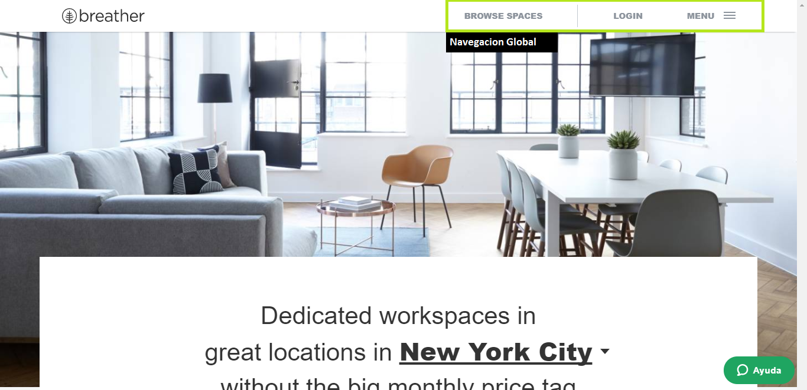
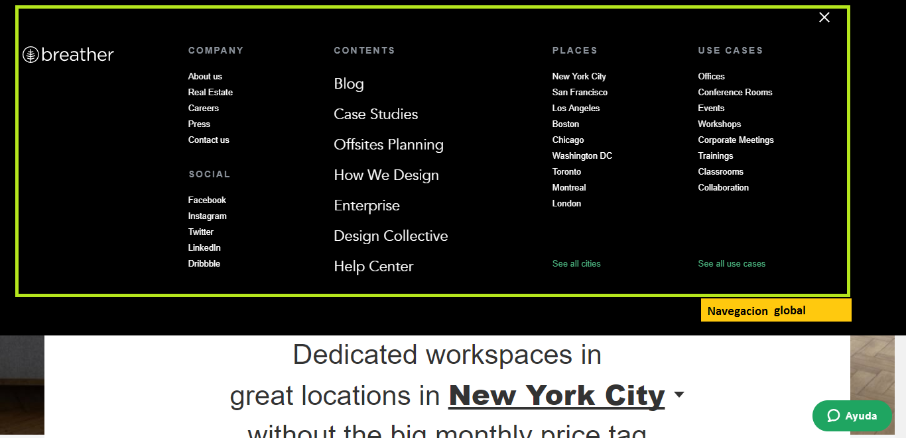
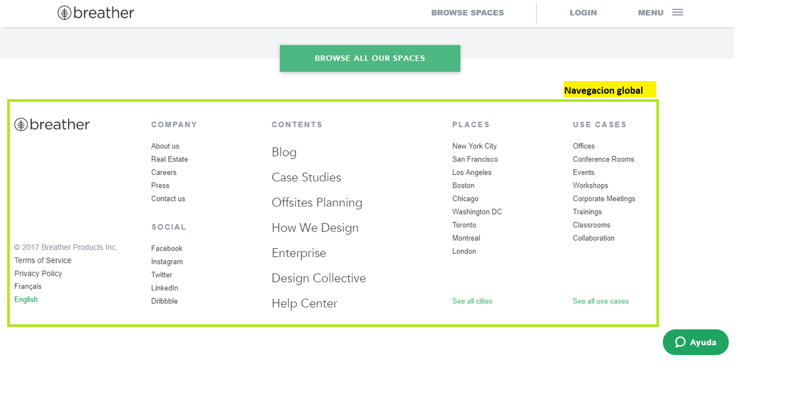
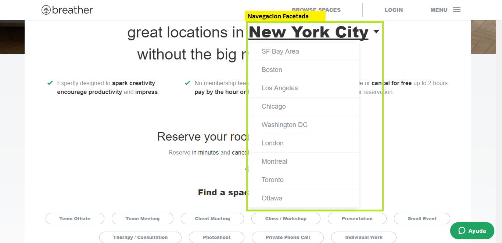
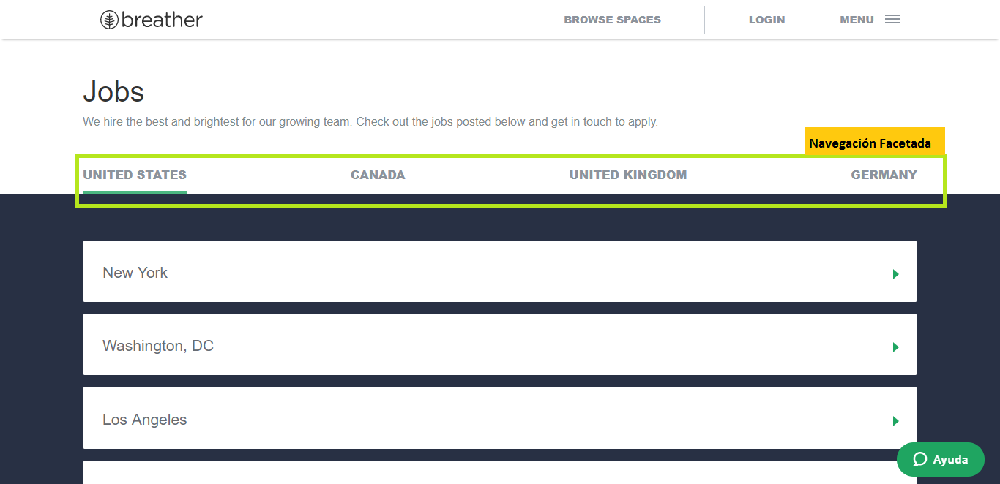
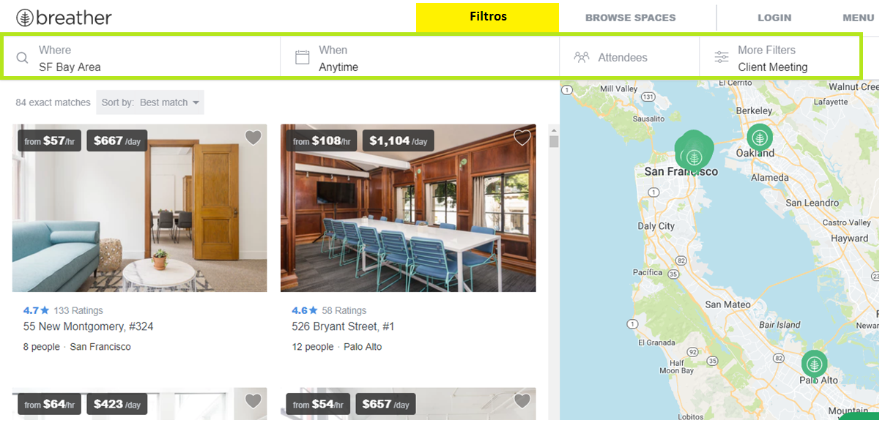
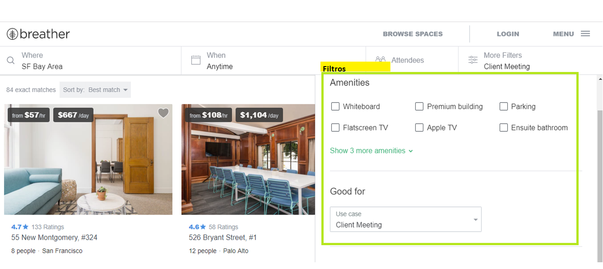

# BREATHER
## Identificando elementos de navegación

*Navegación global*  
En la siguientes figuras se muestran la ubicación de la navegación global en la pagina web.  
La navegación global es la navegación principal a traves de la cual podremos visitar toda la página. 

En esta figura observamos que la navegación global se encuentra en el encabezado de la pagina.

Al hacer click en el menu te muestra detalladamente toda la navegacion global para explorar el sitio.

En el pie de pagina observamos nuevamente la navegación global.

*Navegación facetada*  
Es la navegacion con filtros previamente definidos por el sistema.

*Filtros*  
Navegacion que me permite que el usurio pueda filtrar la información de acuerdo a sus requerimientos.

